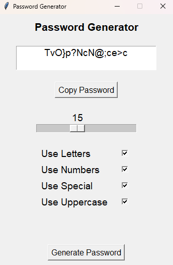

# Password Generator
This is a small application that generates a random password based on user specified requirements
## Table of Contents

- [Features](#features)
- [Installation](#installation)
- [Usage](#usage)
- [Screenshots](#screenshots)

## Features

- Generates a random password
- Copy button to save time
- 5 user-specified requirements
- Password length adjuster

## Installation

### Server Installation

To install and run the Smolink server (Flask) locally, follow these steps:

1. Clone this repository:

    ```
    git clone https://github.com/mespino4/PasswordGenerator
    ```

2. Run the Python file:

    ```
    python main.py
    ```

## Usage

To generate a password follow these steps

1. Run the python file
2. Drag the slider to adjust the generated password length
3. Check or uncheck any requirements you want the password to have
4. Click the "Generate Password" button

## Screenshots


